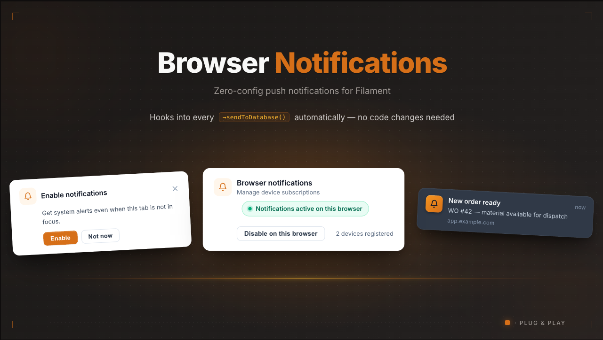
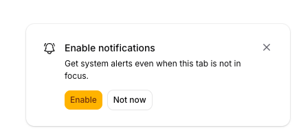
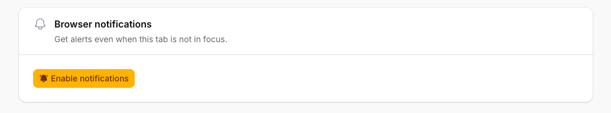
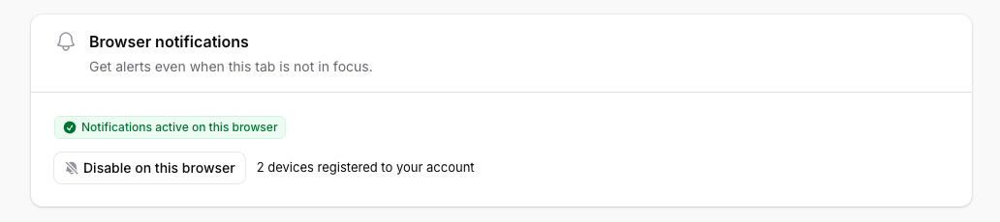

# Filament Browser Notifications

[](https://packagist.org/packages/emuniq/filament-browser-notifications)
[](https://packagist.org/packages/emuniq/filament-browser-notifications)

**Every `sendToDatabase()` in your app automatically triggers a browser push notification — no code changes needed.**



## Screenshots

**Subscription prompt** — appears after a configurable delay, asking the user to enable push notifications.



**Profile section (inactive)** — auto-injected on the Edit Profile page. One-click to enable.



**Profile section (active)** — shows subscription status, device count, and a button to disable.



## Installation

```bash
composer require emuniq/filament-browser-notifications
php artisan browser-notifications:install
```

That's it. The install command handles everything:

- Generates VAPID keys and adds them to `.env`
- Publishes and runs the `push_subscriptions` migration
- Adds the `HasPushSubscriptions` trait to your User model automatically

No manual plugin registration needed — it auto-registers on all Filament panels.
No service worker publishing needed — it's served from a route automatically.
No profile page changes needed — the subscription management section auto-injects.

> **Note:** The trait step requires the process running `artisan` to have write access to your User model (e.g. `app/Models/User.php`). In setups where the model is read-only for PHP (common in some Docker images), the command skips that step and prints instructions to add the trait by hand — it won't fail the install. To do it manually, add the `HasPushSubscriptions` trait to your User model:
>
> ```php
> use NotificationChannels\WebPush\HasPushSubscriptions;
>
> class User extends Authenticatable
> {
>     use HasPushSubscriptions, Notifiable;
> }
> ```

## How it works

```
Your existing code (unchanged)
|
|  Notification::make()->sendToDatabase($users)
|  $user->notify(new YourNotification)  // with 'database' channel
|
'-->  DatabaseNotification::created  <-- plugin hooks here automatically
       |
       +-- Extracts title, body, action URL from notification data
       +-- Throttles: groups burst notifications into one push
       +-- Dispatches queued job (non-blocking)
       |
       '-->  Web Push via VAPID --> Browser shows native OS notification
                                     |
                                     '--> Click: focuses app tab, navigates to action URL
```

## Features

**Core**
- Zero-config piggyback on `DatabaseNotification::created` — no per-notification wiring
- VAPID-only — no Firebase, no external WebSocket servers, no third-party dependencies
- Queued delivery — push dispatch runs as a background job
- Smart click handling — focuses existing tab and navigates, or opens new tab

**Throttle & Grouping**
- Burst protection — multiple notifications within a configurable window (default 5s) are grouped into a single "You have N new notifications" push instead of spamming the user
- Configurable via `throttle_seconds` in config (set to 0 to disable)

**UI**
- Non-intrusive subscription prompt — styled Filament section banner, not the raw browser popup
- Dismiss cooldown — "Not now" hides the prompt for 7 days (configurable via localStorage)
- Opt-out respected — if user disables from profile, no re-subscription or prompt until they re-enable
- Profile section auto-injected — subscription management appears on the Edit Profile page automatically
- Dark mode support via native Filament components

**Plugin**
- Auto-registers on all Filament panels
- Auto-patches User model during install
- Service worker served from route (no asset publishing)
- Panel favicon used as push notification icon
- Dead subscription cleanup (410 Gone auto-deleted by webpush package)
- iOS PWA support — serves `manifest.json`, detects iOS Safari, guides users to Add to Home Screen
- i18n ready — ships with English and Spanish
- Filament 3, 4, and 5 compatible

## Requirements

- PHP 8.1+
- Laravel 10+ / Filament 3+
- HTTPS (required by the Web Push API)
- A queue worker (Horizon, `queue:work`, etc.)

## iOS Support

Push notifications on iOS require the app to be added to the Home Screen as a PWA. The plugin handles this automatically:

- Serves a `manifest.json` with `display: standalone` and icons from your panel favicon
- Injects Apple PWA meta tags
- Detects iOS Safari without PWA and shows "Add to Home Screen" instructions in the profile section
- Once added to Home Screen, the standard VAPID push flow works normally

## Testing your setup

After installation, verify push notifications work:

```bash
php artisan browser-notifications:test 1        # queue the test push
php artisan browser-notifications:test 1 --sync  # send immediately
```

## Configuration

Works out of the box. To customize, override the auto-registered plugin in your PanelProvider:

```php
use Emuniq\FilamentBrowserNotifications\BrowserNotificationsPlugin;

->plugins([
    BrowserNotificationsPlugin::make()
        ->promptDelay(5)           // seconds before showing prompt (default: 2)
        ->dismissCooldownDays(14)  // days before re-prompting (default: 7)
        ->profileSection(false),   // disable auto-injected profile section
])
```

Publish the config for queue and throttle settings:

```bash
php artisan vendor:publish --tag=browser-notifications-config
```

```php
// config/browser-notifications.php
return [
    'prompt_delay' => 2,
    'queue_connection' => null,
    'queue_name' => null,
    'cleanup_dead_subscriptions' => true,
    'throttle_seconds' => 5,  // 0 to disable grouping
];
```

## Suppressing push for specific notifications

Add `'silent' => true` to the notification data to skip the push:

```php
Notification::make()
    ->title('Low priority update')
    ->body('...')
    ->data(['silent' => true])  // no browser push for this one
    ->sendToDatabase($users);
```

## Translations

Ships with English and Spanish:

```bash
php artisan vendor:publish --tag=browser-notifications-lang
```

## Docker / read-only `.env`

Generate VAPID keys manually:

```bash
php artisan tinker --execute="echo json_encode(\Minishlink\WebPush\VAPID::createVapidKeys());"
```

Add to `.env`:

```
VAPID_PUBLIC_KEY=<publicKey>
VAPID_PRIVATE_KEY=<privateKey>
VAPID_SUBJECT=https://your-app.com
```

## Architecture

```
sendToDatabase() / $user->notify()
    | DatabaseNotification::created (Eloquent event)
    v
SendWebPushOnDatabaseNotification (Listener)
    | Checks: has subscriptions? silent? throttle window?
    v
SendDatabaseNotificationWebPush (Queued Job, delayed if throttled)
    | Counts recent unread notifications
    | 1 notification: sends original title/body
    | N notifications: sends grouped "You have N new notifications"
    v
GenericWebPushNotification -> WebPushChannel -> VAPID -> Push endpoint
    v
Service Worker (sw.js) -> showNotification() -> notificationclick -> navigate
```

## License

MIT

---

## Maintained by [Emuniq](https://emuniq.com)

This plugin is built and maintained by **Emuniq** — a Laravel & Filament consultancy based in Mexico. We help teams ship admin panels, custom Filament resources, and SaaS backoffices.

- 🌐 Website: [emuniq.com](https://emuniq.com)
- 💼 Need a hand with your Filament project? [Get in touch](https://emuniq.com).
- ⭐ If this plugin saves you time, a [GitHub star](https://github.com/Emuniq/filament-browser-notifications) helps others find it.
